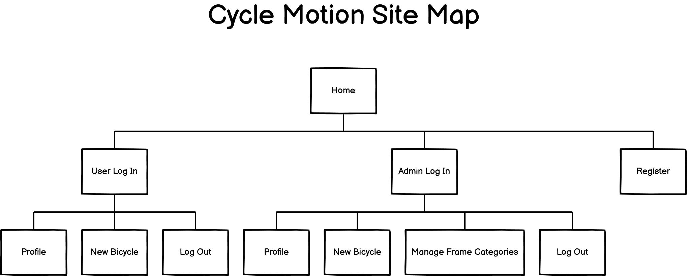

   
   

# Cycle Motion
*Constructed as part of Code Institute's Milestone 3 Project: Python and Data Centric Development module*

## Introduction

I would like to express by conveying and hopefully extending a cordial welcome to you all into this third milestone project, which the theme is based on one of my passions as a regular hobby and that is the sport of cycling. This is so much so, such that I am deeply yet strongly indebted to it for getting through the last nearly two years and the experience has especially contributed to the milestone achievement of the 170 miles route into the [Way of the Roses](https://www.wayoftheroses.info), from Morecambe to Bridlington within two days (most people would do it within three days which is admirable!). The purpose of that was to fundraise money for [Hearing Dogs for Deaf People](https://www.hearingdogs.org.uk/) back in June 2019 to help deaf recipients be alerted to important and life-saving sounds, reduce a sense of isolation by having a loyal companion and friend, and in addition increase their sense of independency with confidence, especially more so during the pandemic.

It was no surprise to learn the effects of a boom in cycling last year from a wellbeing and environmental perspective as supported with sources from 2020 by [The Guardian](https://www.theguardian.com/lifeandstyle/2020/may/23/two-wheels-good-bike-sales-soar-as-uk-takes-to-cycling) and also [The BBC](https://www.bbc.com/future/bespoke/made-on-earth/the-great-bicycle-boom-of-2020.html) to the extent that the sales into the levels of demand had outstripped supply as reported back earlier in 2021 through [The Guardian](https://www.theguardian.com/business/2021/mar/21/cycling-boom-rolls-on-amid-struggle-to-meet-uk-demand-during-covid). This in my view, is fantastic news for the 'global warming' environment ahead of the COP26 and its climate with the hope of reducing the emissions. It is also very positively encouraging for us all to recognise the emphasis of the great benefits towards our mental health & wellbeing in general as well as potentially leading healthier, yet greener, economically friendly lives by utilising a method of transportation that is cost-effective (inspiration should be sourced through the lifestyle and infrastructure of the Netherlands) which could contribute to filling keen cyclists with adventure and challenges which is simple to maintain!

## Demonstration

### **Responsive image of website**

<!-- actual image of responsive cycle motion website from amiresponsive -->

**[Active link to Cycle Motion](https://cycle-motion.herokuapp.com/)**

## Table of Contents

1. [Overview](#overview)
2. [User Experience Design (UXD)](#user-experience-design)
   1. [Project Goals](#project-goals)
   2. [Strategy](#strategy)
   3. [Scope](#scope)
      - [User Stories](#user-stories)
      - [Features](#features)
         - [Future Features](#future-features)
   4. [Structure](#structure)
      - [Interaction Design (IXD)](#interaction-design)
      - [Information Architecture](#information-architecture)
      - [Sitemap](#sitemap)
   5. [Skeleton](#skeleton)
      - [Wireframing the Website](#wireframing-the-website)
   6. [Surface](#surface)
      - [Colour Palette](#colour-palette)
      - [Typography](#typography)
      - [Icons](#icons)
      - [Imagery](#imagery)
3. [Technologies Utilised](#technologies-utilised)
   - [Development Tools](#development-tools)
   - [Design](#design)
   - [Languages](#languages)
   - [Libraries](#libraries)
   - [Database](#database)
4. [Project Bugs and Solutions](#project-bugs-and-solutions)
5. [Testing](#testing)
   - [W3C Validator Tools](#w3c-validator-tools)
   - [JSHint](#jshint)
   - [PEP8 Online](#pep8-online)
   - [Responsive Tools](#responsive-tools)
   - [User Stories](#user-stories)
   - [General technical testing](#general-technical-testing)
6. [Deployment](#deployment)
   - [Initial Deployment](#initial-deployment)
   - [Fork a Repository](#fork-a-repository)
   - [Clone a Respository](#clone-a-repository)
   - [Generate a Local Clone](#generate-a-local-clone)
7. [Credits](#credits)
   - [Code](#code)
   - [Contents](#contents)
   - [Media](#media)
   - [Acknowledgements](#acknowledgements)
8. [Disclaimer](#disclaimer)

# Overview

This third milestone project signifies being at over the halfway point into the Diploma of the Full Stack Website Development course with the Code Institute in association with the Learning People and reflectively I came to realise a positive perspective in this coding and programming journey, that really resonates with me whilst typing up this README.md documentation file and that is:- look how far I've progressed with the knowledge of the skillset and yet how much more advancement I can continue to make before completing the course!

Upon approaching the inception stage into this website, the continued learning experience previously transitioned further from the Interactive Front-end Development and progressively advanced to explore deeply into the fundamentals of Python and the Back-end Development. This focused on the core concepts of the popular programming language, utilising one of the external libraries of Python such as the Flask Framework, the templating language of Jinja and deploying from Heroku. It also gave an opportunity in re-familiarising myself into the fundamentals & meaning of data, its entities & attributes, the entity-relationship model and the processes into the modelling of the relational design of databases. It has been interesting discovering a new skill of how Python connects to utilise with either databases of MySQL or MongoDB (whereas I had previously used the language of PHP with MySQL), which will lead into the construction of this milestone project.

In essence, it represents the commencing point of incorporating the already established knowledge & skills of the front-end (design and interaction) i.e. the utilisation of the languages of HTML, CSS & JavaScript; with the addition of the learning progression into the back-end (connecting and interacting with the database) to construct the website for the first time in my coding journey, which the terminology is described as a full-stack development.

With this in mind, the core focus of this project is to construct a back-end website that is based on road bicycle reviews and recommendations, which will allow the value of visitors and users alike who have a love of cycling to find bicycles of interest in order to view the reviews of other users, share their own review(s) upon utilising it or alternatively upload details of a recommendation(s).

# User Experience Design

## Project Goals

The core goal of the project is solely centred on the ability to demonstrate the understanding of back-end development, whereby it allows the welcoming enticement of visitors or users to the website, which provides the opportunity to interact with one another as part of an online community environment. The purpose into this goal is to assist them with their research by creating a website experience of sharing data into their own cycling knowledge and/or experience of differing levels, whereby it is based on pre-existing data of road bicycles.

This project aims to enable the experience of discovering the value of the products which is yet to be explored e.g. the road bicycle is new to the market, or it is reasonably new in that some reviews has been established yet could still be perceived with some room for improvement to enhance that value and it has not reached in being fully recognised as a valuable product. It would also aim to provide the value of conveniently being able to access all the data stored that has been shared by the administrator and in particular the core value would be the reviews and/or recommendations from other cycling members to benefit in making a decision based on a choice of bicycles available to potentially purchase. 

Finally, it will also utilise the learning experience of the Python language, Flask Framework, Jinja templating and into the development of a chosen database (MySQL vs MongoDB), which will form the crux of the project. The purpose of this is to store data of a common nature that will allow users to manage the dataset by utilising the methodology of the CRUD Operations and essentially progress into constructing what the terminology is known as a full-stack website which is deployed from Heroku.

To summarise the website project's goals as an application, it will:

* Demonstrate the implementation from acquiring a new knowledge & skill in Python and the development of the back-end whilst supplementing the experience of the front-end e.g. HTML, CSS & JavaScript.
* Construct an application that elicits a positive user experience whereby it encourages new/returning visitors to continue with their interest or hobby, in an engaging way with an outcome of it being resourceful to them and that they have gained value from it. 
* Ensure that the content is viewable / accessible publically which would encourage the usage of the application by registering to enable the ability to add reviews.
* Provide the functionality of the CRUD Operations to allow visitors or users alike to be able to manage their data once registered with ease, then subsequently logged in and out of the application which enables the storage and retrieval of their data easily.
* Construct an application that is fully responsive that reflects the majority of device types and screen sizes which is functionally easy to use.

## Strategy

Given that this third project will shift to focus on the subject of reviews into products in comparison to previous milestone projects, I felt it to be a worthwhile approach to include the high level considerations within this plane due to its relevancy. This would factor in discovering the product's value, hence the existence of the application and takes into consideration the likelihood that visitors and users alike will as an act be researching or as a customer, have already recognised the perceived value of the product. They will then use it to share opinions and viewpoints amongst others in their experience of it, perhaps raising brand awareness or the quality of the product in discussions based on the budget and the strategy aims to cater for this.

It would also factor in questions concerning the content whereby the intention is to provide data based on road bicycle models of 2021/22 within the current market including e.g. specifications into the product, images, ratings and reviews and/or recommendations. This is to be considered through the development of the database design model whereby the functionality of the database would be in the form of utilising the methodology of the CRUD (aka Create, Read, Update and Delete) Operations, which will form the core basis into the construction in that users or visitors alike would be able to manipulate their data and equally the administrator as well. In effect, some content as data would need to be tracked and catalogued in an intuitive way i.e. does the search match up with the data extracted?

An element of the psychological factor would be implemented as well whereby I intend to keep content to a minimal, displaying essential information of the product that involves extracting the stored information from the database of choice, then each product would be attributed with a large image, which would be displayed as a strong emotive item. On the basis of that, content would have to be culturally appropriate and relevant for the cycling community to allow users to generate the review and/or recommendations. Overall, these will form the basis of my strategy for this website.

The target audience for this application would be open to anyone who is new to cycling, an amateur that enjoys the sporting activity and a professional who has experience who knows what bicycles are suitable for a purpose, i.e. sportives or touring. Demographics such as age is not limited within the target market, but the ability to be technically computer literate.

## Scope

### User Stories

### Features

These items are above are determined in the below table:
*(scale is judged whereby 0 is insignificant and 5 represents as very important)*

| Item | Description                       | Importance | Viability | Score |
| ---- | --------------------------------- | ---------- | --------- | ----- |
| 1.   |      |           |          |      |
| 2.   |      |           |          |      |
| 3.   |      |           |          |      |
| 4.   |      |           |          |      |
| 5.   |      |           |          |      |
| 6.   |      |           |          |      |
| 7.   |      |           |          |      |
| 8.   |      |           |          |      |
| 9.   |      |           |          |      |
| 10.  |      |           |          |      |
| 11.  |      |           |          |      |
| 12.  |      |           |          |      |
| 13.  |      |           |          |      |

#### Future Features

## Structure

### Interaction Design

### Information Architecture

### Sitemap

## Skeleton

## Wireframing the Website

## Surface

### Colour Palette

Source: [Coolors](https://coolors.co/7a918d-93b1a7-99c2a2-c5edac-dbfeb8)

### Typography

### Icons

### Imagery

# Technologies Utilised

## Development Tools

[GitHub](https://www.github.com/) :- this is a collaborative tool which consists of a community of developers and has been used to create the repository and store the coding of the project subsequent from being pushed via Git.

[GitPod](https://www.gitpod.io/) :- an online Integrated Development Environment (IDE) editor utilised to create folders, files and code the website.

[Git](https://www.git-scm.com/) :- a form of versioning control by way of utilising the terminal within Gitpod to commit to Git, then subsequently push to GitHub.

<!-- will this be incorporated into MS3? -->
<!-- [EmailJS](https://www.emailjs.com/) :- this is a client-side technology that helps to send emails. -->

[Google Chrome Developer tools](https://www.google.com/intl/en_uk/chrome/) :- the feature within the browser was used to test both the code and the responsiveness of the website.

[Mozilla Firefox Developer tools](https://www.mozilla.org/en-GB/firefox/new/) :- the feature within the browser was used to test both the code and the responsiveness of the website.

<!-- utilised for the outcome of testing procedures -->
[paint.net](https://www.getpaint.net/) :- was used to produce images of resized screenshots into the website for the readme.md.

## Design

[Balsamiq](https://www.balsamiq.com/) :- the software has been utilised whereby it is related to the creation of wireframes as part of the preparational work into the duration of the design process through the Cycle Motion milestone project.

[Google Fonts](https://fonts.google.com/) :- these were used to import the typography of the website into the stylesheet file and is utilised on all webpages.

<!-- not decided whether to apply font awesome into this website -->
<!-- [Font Awesome](https://fontawesome.com/) :- these icons would be added for the purpose of aesthetic appeal and UX design. -->

<!-- might not be needing this into the website -->
<!-- [ezGIF](https://ezgif.com) :- this was used to create an animated gif file which in turn was converted to a favicon. -->

[favicon](https://www.favicon.cc/) :- the website was used to create a favicon, a small image that is displayed within the tab of the internet browser.

## Languages

     

[Python](https://www.python.org) :- 

[JavaScript](https://www.javascript.com/) :- 

CSS3 :- this is the current standard that is used to style HTML content of the website.

HTML5 :- this is the current standard that is used for the markup structure of the website.

## Libraries

<!-- not decided yet between Bootstrap and Materialize but most likely to be the latter -->
<!-- [Bootstrap v5](https://www.getbootstrap.com/)/[Materialize](https://www.materializecss.com) :- this is a CSS framework which is used to assist with making the design responsive whilst being complimentary with the styling of the website. -->

[jQuery](https://www.jquery.com/) :- 

<!-- will this be used in Materialize? -->
<!-- [Popper.js](https://www.popper.js.org/) :-  -->

[Flask](https://www.palletsprojects.com/p/flask/) :- this is "a lightweight WSGI web application framework" that is written in Python.

[Werkzeug](https://www.palletsprojects.com/p/werkzeug/) :- this is "a comprehensive WSGI web application library which has become one of the most advanced WSGI utility libraries." It is wrapped by Flask whereby it is "using it to handle the details of [the] Web Server Gateway Interface while providing more structure and patterns for defining powerful applications".

[Jinja](https://www.palletsprojects.com/p/jinja/) :- this is "one of the most used template engines for Python" whereby it simplifies the creation of HTML webpages.

[PyMongo](https://pymongo.readthedocs.io/en/stable/) :- this is the official driver that is used to connect to MongoDB via the Python language.

[DNSPython](https://www.dnspython.org/) :- this is "a DNS toolkit for Python [whereby] it is used for high level classes [to] perform queries for data of a given name, type, and class, and return an answer set".

[Flask-PyMongo](https://flask-pymongo.readthedocs.io/en/latest/) :- this "bridges Flask and PyMongo [whereby it] provides some convenience helpers". It is used to connect the app of Python/Flask to MongoDB.

## Database

[MongoDB](https://www.mongodb.com/) :- 

# Project Bugs and Solutions

# Testing

As standard with any development into a website, the first step subsequent to the conclusion of the construction is to check using a variety of technical testing tools (and this time includes two additions of JSHint and PEP8) which are split into subsections:

## W3C Validator Tools

The basic methodology for checking into any form of errors commences by utilising the [W3C Markup Validation Service](https://validator.w3.org/) against all my HTML webpages of this project.

The next validation tool is to utilise the [W3C CSS Validation Service](https://jigsaw.w3.org/css-validator/) which checks into the CSS styling of the project's webpages.

## JSHint

[JSHint](https://www.jshint.com) is a tool that assists in the quality of JavaScript by detecting errors and potential problems within the code.

## PEP8

[PEP8](https://www.python.org/dev/peps/pep-0008) is a website that provides the styling conventions or best practices into the Python code which will be used within this project.

[PEP8 Online](https://www.pep8online.com) is an online checker for PEP8 requirements to ensure that it is complying to conventions.

## Responsive Tools

A website by the name of [Am I Responsive](http://ami.responsivedesign.is/) was utilised to give an indication into the responsiveness of how the project caters for the layout design within a range of devices. 

## User Stories

## General Technical Testing

# Deployment

Given that the deployment of the previous second milestone project was based on GitHub Pages, which allows the hosting of static websites, the learning experience and skills of the subsequent module into Back-end Development have progressively transitioned whereby the language of Python will be adopted in this third milestone project therefore the hosting provider of Heroku is necessary as Python cannot be hosted on GitHub Pages.

## Initial Deployment

The development into this third milestone project has utilised the IDE of [GitPod](https://www.gitpod.io) which was subsequently pushed to the development community of [GitHub](https://www.github.com) and finally deployed using the recommended hosting provider of [Heroku](https://www.heroku.com). As a result of this, the following steps should be taken as specified below:

1. Create a file entitled as `requirements.txt` using the command of `pip3 freeze --local > requirements.txt` within the terminal of GitPod.
2. Using the same GitPod terminal, create a `Procfile` via the command of `echo web: python app.py > Procfile`.
3. Next, enter the command of either `git add.` or `git add -A` and then `git commit -m` the new requirements and Procfile files respectively before finally executing a `git push` to the GitHub repository.
4. Within the website of [Heroku](https://www.heroku.com), either Sign up or Log in where applicable.
5. Once you have signed up or logged in on Heroku, the creation of a new application is done through the click of the 'Create New App' button within your dashboard. Then choose a unique name and set the region that is closest to you e.g. Europe.
6. Within the dashboard of Heroku of your newly created application, click on "Deploy" > "Deployment method", then select "GitHub" and finally click the "Connect to GitHub" button.
7. Search for your correct GitHub repository name that you have created and confirm the linking up through a click on the "Connect" button.
8. Return back to your Heroku dashboard and click on "Settings" > "Reveal Config Vars".
9. Set the following config vars as:

| Key | Value |
| ----------|--------- |
| PORT | 5000 |
| IP | 0.0.0.0 |
| DEBUG | False |
| MONGO_URI | USER_MONGODB_URI |
| MONGO_DBNAME | USER_MONGODB_NAME |
| Secret_Key | USER_SECRET_KEY |

## Fork a Repository

Should you wish to create a duplicate copy of a repository, the following simple steps is to be taken:

1. Log in to GitHub
2. Within GitHub, direct yourself to [swiftcoder2020/cycle-motion](https://github.com/swiftcoder2020/cycle-motion)
3. Navigate to the top right corner and click "Fork"

## Clone a Respository

To clone a repository, the instructions are as follows:

1. Log in to GitHub
2. Fork the repository of swiftcoder2020/cycle-motion using the simple steps of [Fork a Repository](#fork-a-repository) as aforementioned in the previous section above.
3. Below the name of the repository and above the list of files, click "Code"
4. Choose if you want to clone using HTTPS, SSH or GitHub CLI, then click the copy button to the right
5. Open Git Bash
6. Change the directory to where you want your clone to go
7. Type "git clone" and then paste the URL you copied in step 4
8. Press Enter to generate your clone

## Generate a Local Clone

The following steps should be processed in order to 

1. Firstly, log in to GitHub
2. Again, below the name of the repository and above the list of files, click "Code"
3. Similar to point 4 of 'Clone a Repository', only this time you should clone the repository using HTTPS and click on the icon to copy the link.
4. Next, open Git Bash
5. Amend the current working directory to the new location, where you want the cloned directory to be.
6. Type `git clone` and then after, paste the copied URL from step 4
7. Press the Enter button and your local clone will be created. 

# Credits

## Code

## Contents

## Media

## Acknowledgements

I would first and foremost like to thank the sterling work of Tim Nelson at the Code Institute for providing a fantastic series of tutorial walkthrough videos into the mini-project of the **Task Manager application** as this has inspired me to base or implement this within the construction of the milestone project and comprehending the methodology of the CRUD operations.

Secondly I would like to thank my mentor *Marcel Mulders* for his constant guiding help and support.

Lastly I would also like to give my grateful thanks to two of my amazing cheerleaders in Suzy Bennett & Emanuel 'Manni' Silva for their daily/weekly support in our little study group.

# Disclaimer

This website project has been constructed for educational purposes only.