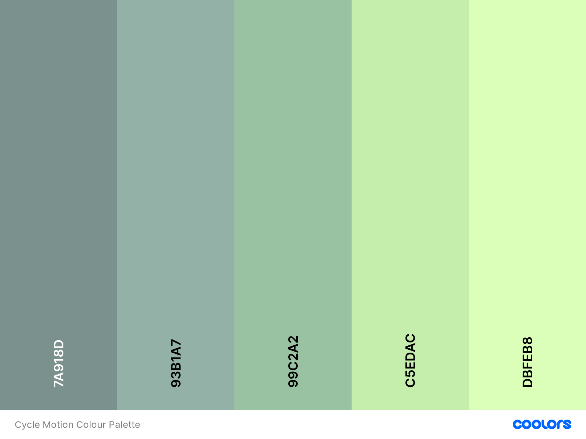

   
   

# Cycle Motion
*Constructed as part of Code Institute's Milestone 3 Project: Python and Data Centric Development module*

## Introduction

I would like to express a wish in conveying and hopefully extending a cordial welcome to you all into my third milestone project that is based on one of my passions as a hobby which is cycling. This is so much so, such that I am deeply indebted to it for getting through the last nearly two years and especially achieving the 170 miles route of the Way of the Roses, from Morecambe to Bridlington within two days. The purpose was to fundraise money for Hearing Dogs for Deaf People back in 2019 to help deaf recipients reduce a sense of isolation and increase their sense of independency with confidence. 

It was no surprise to me, let alone to us all perhaps when there was a boom in the sport of cycling last year from a sales perspective as supported of sources from 2020 by [The Guardian](https://www.theguardian.com/lifeandstyle/2020/may/23/two-wheels-good-bike-sales-soar-as-uk-takes-to-cycling) and also [The BBC](https://www.bbc.com/future/bespoke/made-on-earth/the-great-bicycle-boom-of-2020.html) to the extent that demand had outstripped the supply levels as reported back earlier in 2021 through [The Guardian](https://www.theguardian.com/business/2021/mar/21/cycling-boom-rolls-on-amid-struggle-to-meet-uk-demand-during-covid). This is in my view fantastic news for the 'global warming' environment and its climate with the hope of reducing this and encouraging for us all to lead healthier, yet greener economically friendly lives filled with adventure and challenges!

## Demonstration

### **Responsive image of website**

<!-- image of responsive cycle motion website from amiresponsive -->

**[Active link to Cycle Motion](#)**

## Table of Contents

1. [Overview](#overview)
2. [User Experience Design (UXD)](#user-experience-design)
   1. [Project Goals](#project-goals)
   2. [Strategy](#strategy)
   3. [Scope](#scope)
      - [User Stories](#user-stories)
      - [Features](#features)
         - [Future Features](#future-features)
   4. [Structure](#structure)
      - [Interaction Design (IXD)](#interaction-design)
      - [Information Architecture](#information-architecture)
      - [Sitemap](#sitemap)
   5. [Skeleton](#skeleton)
      - [Wireframing the Website](#wireframing-the-website)
   6. [Surface](#surface)
      - [Colour Palette](#colour-palette)
      - [Typography](#typography)
      - [Icons](#icons)
      - [Imagery](#imagery)
3. [Technologies Utilised](#technologies-utilised)
   - [Development Tools](#development-tools)
   - [Design](#design)
   - [Languages](#languages)
   - [Libraries](#libraries)
   - [Database](#database)
4. [Project Bugs and Solutions](#project-bugs-and-solutions)
5. [Testing](#testing)
   - [W3C Validator Tools](#w3c-validator-tools)
   - [JSHint](#jshint)
   - [PEP8 Online](#pep8-online)
   - [Responsive Tools](#responsive-tools)
   - [User Stories](#user-stories)
   - [General technical testing](#general-technical-testing)
6. [Deployment](#deployment)
   - [Initial Deployment](#initial-deployment)
   - [Fork a Repository](#fork-a-repository)
   - [Clone a Respository](#clone-a-repository)
   - [Generate a Local Clone](#generate-a-local-clone)
7. [Credits](#credits)
   - [Code](#code)
   - [Contents](#contents)
   - [Media](#media)
   - [Acknowledgements](#acknowledgements)
8. [Disclaimer](#disclaimer)

# Overview

This third milestone project signifies being at over the halfway point into the Diploma of the Full Stack Website Development course with the Code Institute in association with the Learning People and reflectively I came to realise a positive perspective in my coding and programming journey to undertake a career change which really resonates with me whilst typing up this README.md file and that is:- look how far I've come and yet how much more progress I can make or to continue with before completing the course!

Upon approaching the inception stage into this website, the continued learning experience previously transitioned further and progressively explored deeply into the fundamentals of the popular programming language in Python and Back-end Development. This focused on utilising the Python library of the Flask Framework, Jinja templating language, deploying from Heroku, looking into data and databases e.g. how Python connects/links in with either MySQL or MongoDB, the relational design of the database.

# User Experience Design

## Project Goals

The goal of the project is based on the ability to allow visitors or users to the website which provides the opportunity to engage as an online community by sharing data of their own knowledge or experience into bicycles in differing levels. This data would be stored as a dataset of a common nature within a database of choice in relation to a subject, which in this case is cycling. It also represents the commencing point of incorporating the already established knowledge & skills of the front-end i.e. the utilisation of the languages of HTML, CSS & JavaScript; with the learning progression of the back-end to construct the website for the first time in my coding journey, which the terminology is described as a full-stack. Finally it aims to provide the value of utilising the website which they are conveniently able to access all the data stored that is shared by other members to benefit in making a decision based on a choice of bicycles available to purchase.

## Strategy

## Scope

### User Stories

### Features

#### Future Features

## Structure

### Interaction Design

### Information Architecture

### Sitemap

## Skeleton

## Wireframing the Website

## Surface

### Colour Palette

Source: [Coolors](https://coolors.co/7a918d-93b1a7-99c2a2-c5edac-dbfeb8)
### Typography

### Icons

### Imagery

# Technologies Utilised

## Development Tools

[GitHub](https://www.github.com/) :- this is a collaborative tool which consists of a community of developers and has been used to create the repository and store the coding of the project subsequent from being pushed via Git.

[GitPod](https://www.gitpod.io/) :- an online Integrated Development Environment (IDE) editor utilised to create folders, files and code the website.

[Git](https://www.git-scm.com/) :- a form of versioning control by way of utilising the terminal within Gitpod to commit to Git, then subsequently push to GitHub.

<!-- will this be incorporated into MS3? -->
<!-- [EmailJS](https://www.emailjs.com/) :- this is a client-side technology that helps to send emails. -->

[Google Chrome Developer tools](https://www.google.com/intl/en_uk/chrome/) :- the feature within the browser was used to test both the code and the responsiveness of the website.

[Mozilla Firefox Developer tools](https://www.mozilla.org/en-GB/firefox/new/) :- the feature within the browser was used to test both the code and the responsiveness of the website.

<!-- utilised for the outcome of testing procedures -->
[paint.net](https://www.getpaint.net/) :- was used to produce images of resized screenshots into the website for the readme.md.

## Design

[Balsamiq](https://www.balsamiq.com/) :- the software has been utilised whereby it is related to the creation of wireframes as part of the preparational work into the duration of the design process through the Cycle Motion milestone project.

[Google Fonts](https://fonts.google.com/) :- these were used to import the typography of the website into the stylesheet file and is utilised on all webpages.

<!-- not decided whether to apply font awesome into this website -->
<!-- [Font Awesome](https://fontawesome.com/) :- these icons would be added for the purpose of aesthetic appeal and UX design. -->

<!-- might not be needing this into the website -->
<!-- [ezGIF](https://ezgif.com) :- this was used to create an animated gif file which in turn was converted to a favicon. -->

[favicon](https://www.favicon.cc/) :- the website was used to create a favicon, a small image that is displayed within the tab of the internet browser.

## Languages

     

[Python](https://www.python.org) :- 

[JavaScript](https://www.javascript.com/) :- 

CSS3 :- this is the current standard that is used to style HTML content of the website.

HTML5 :- this is the current standard that is used for the markup structure of the website.

## Libraries

<!-- not decided yet between Bootstrap and Materialize but most likely to be the latter -->
<!-- [Bootstrap v5](https://www.getbootstrap.com/)/[Materialize](https://www.materializecss.com) :- this is a CSS framework which is used to assist with making the design responsive whilst being complimentary with the styling of the website. -->

[jQuery](https://www.jquery.com/) :- 

<!-- will this be used in Materialize? -->
<!-- [Popper.js](https://www.popper.js.org/) :-  -->

[Flask](https://www.palletsprojects.com/p/flask/) :- this is "a lightweight WSGI web application framework" that is written in Python.

[Werkzeug](https://www.palletsprojects.com/p/werkzeug/) :- this is "a comprehensive WSGI web application library which has become one of the most advanced WSGI utility libraries." It is wrapped by Flask whereby it is "using it to handle the details of [the] Web Server Gateway Interface while providing more structure and patterns for defining powerful applications".

[Jinja](https://www.palletsprojects.com/p/jinja/) :- this is "one of the most used template engines for Python" whereby it simplifies the creation of HTML webpages.

[PyMongo](https://pymongo.readthedocs.io/en/stable/) :- this is the official driver that is used to connect to MongoDB via the Python language.

[DNSPython](https://www.dnspython.org/) :- this is "a DNS toolkit for Python [whereby] it is used for high level classes [to] perform queries for data of a given name, type, and class, and return an answer set".

[Flask-PyMongo](https://flask-pymongo.readthedocs.io/en/latest/) :- this "bridges Flask and PyMongo [whereby it] provides some convenience helpers". It is used to connect the app of Python/Flask to MongoDB.

## Database

[MongoDB](https://www.mongodb.com/) :- 

# Project Bugs and Solutions

# Testing

As standard with any development into a website, the first step subsequent to the conclusion of the construction is to check using a variety of technical testing tools (and this time includes two additions of JSHint and PEP8) which are split into subsections:

## W3C Validator Tools

The basic methodology for checking into any form of errors commences by utilising the [W3C Markup Validation Service](https://validator.w3.org/) against all my HTML webpages of this project.

The next validation tool is to utilise the [W3C CSS Validation Service](https://jigsaw.w3.org/css-validator/) which checks into the CSS styling of the project's webpages.

## JSHint

[JSHint](https://www.jshint.com) is a tool that assists in the quality of JavaScript by detecting errors and potential problems within the code.

## PEP8

[PEP8](https://www.python.org/dev/peps/pep-0008) is a website that provides the styling conventions or best practices into the Python code which will be used within this project.

[PEP8 Online](https://www.pep8online.com) is an online checker for PEP8 requirements to ensure that it is complying to conventions.

## Responsive Tools

A website by the name of [Am I Responsive](http://ami.responsivedesign.is/) was utilised to give an indication into the responsiveness of how the project caters for the layout design within a range of devices. 

## User Stories

## General Technical Testing

# Deployment

Given that the deployment of the previous second milestone project was based on GitHub Pages, which allows the hosting of static websites, the learning experience and skills of the subsequent module into Back-end Development have progressively transitioned whereby the language of Python will be adopted in this third milestone project therefore the hosting provider of Heroku is necessary as Python cannot be hosted on GitHub Pages.

## Initial Deployment

The development into this third milestone project has utilised the IDE of [GitPod](https://www.gitpod.io) which was subsequently pushed to the development community of [GitHub](https://www.github.com) and finally deployed using the recommended hosting provider of [Heroku](https://www.heroku.com). As a result of this, the following steps should be taken as specified below:

1. Create a file entitled as `requirements.txt` using the command of `pip3 freeze --local > requirements.txt` within the terminal of GitPod.
2. Using the same GitPod terminal, create a `Procfile` via the command of `echo web: python app.py > Procfile`.
3. Next, enter the command of either `git add.` or `git add -A` and then `git commit -m` the new requirements and Procfile files respectively before finally executing a `git push` to the GitHub repository.
4. Within the website of [Heroku](https://www.heroku.com), either Sign up or Log in where applicable.
5. Once you have signed up or logged in on Heroku, the creation of a new application is done through the click of the 'Create New App' button within your dashboard. Then choose a unique name and set the region that is closest to you e.g. Europe.
6. Within the dashboard of Heroku of your newly created application, click on "Deploy" > "Deployment method", then select "GitHub" and finally click the "Connect to GitHub" button.
7. Search for your correct GitHub repository name that you have created and confirm the linking up through a click on the "Connect" button.
8. Return back to your Heroku dashboard and click on "Settings" > "Reveal Config Vars".
9. Set the following config vars as:

| Key | Value |
| ----------|--------- |
| PORT | 5000 |
| IP | 0.0.0.0 |
| DEBUG | False |
| MONGO_URI | USER_MONGODB_URI |
| MONGO_DBNAME | USER_MONGODB_NAME |
| Secret_Key | USER_SECRET_KEY |

## Fork a Repository

Should you wish to create a duplicate copy of a repository, the following simple steps is to be taken:

1. Log in to GitHub
2. Within GitHub, direct yourself to [swiftcoder2020/cycle-motion](https://github.com/swiftcoder2020/cycle-motion)
3. Navigate to the top right corner and click "Fork"

## Clone a Respository

To clone a repository, the instructions are as follows:

1. Log in to GitHub
2. Fork the repository of swiftcoder2020/cycle-motion using the simple steps of [Fork a Repository](#fork-a-repository) as aforementioned in the previous section above.
3. Below the name of the repository and above the list of files, click "Code"
4. Choose if you want to clone using HTTPS, SSH or GitHub CLI, then click the copy button to the right
5. Open Git Bash
6. Change the directory to where you want your clone to go
7. Type "git clone" and then paste the URL you copied in step 4
8. Press Enter to generate your clone

## Generate a Local Clone

The following steps should be processed in order to 

1. Firstly, log in to GitHub
2. Again, below the name of the repository and above the list of files, click "Code"
3. Similar to point 4 of 'Clone a Repository', only this time you should clone the repository using HTTPS and click on the icon to copy the link.
4. Next, open Git Bash
5. Amend the current working directory to the new location, where you want the cloned directory to be.
6. Type `git clone` and then after, paste the copied URL from step 4
7. Press the Enter button and your local clone will be created. 

# Credits

## Code

## Contents

## Media

## Acknowledgements

I would first and foremost like to thank the sterling work of Tim Nelson at the Code Institute for providing a fantastic series of tutorial walkthrough videos into the mini-project of the **Task Manager application** as this has inspired me to base or implement this within the construction of the milestone project and comprehending the methodology of the CRUD operations.

Secondly I would like to thank my mentor *Marcel Mulders* for his constant guiding help and support.

Lastly I would also like to give my grateful thanks to two of my amazing cheerleaders in Suzy Bennett & Emanuel 'Manni' Silva for their daily/weekly support in our little study group.

# Disclaimer

This website project has been constructed for educational purposes only.